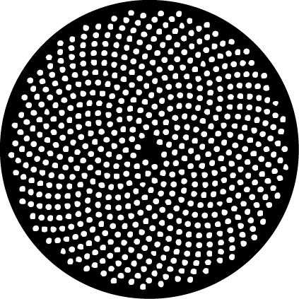
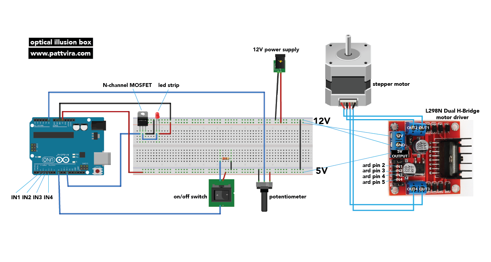

## 02_OpticalIllusionBox
[pattvira.com/optical_illusion_box](http://pattvira.com/optical_illusion_box)

[Video documentation](https://youtu.be/s-N7QZBRejU)

I tell them I built a “phyllotaxis phenakistoscope” and they give me that puzzle look. So I say I built a super cool optical illusion box, and they go ooh and aah. 

### Overview

Yes, I built a phyllotaxis phenakistoscope. 

What is a phenakistoscope? 

A phenakistoscope is an optical illusion device that creates an illusion of motion by looking at a series of images at an offset interval. The image is blurred when observed with the naked eyes, but can be seen clearly with a help of a strobe light. The image became clear when the light frequency is synced up to the rotational speed of the motor. A quick example calculation of how this works. 

Say a disc is divided into 12 even slices of pies. And say the motor runs at a speed of 1 revolution per second (or 60 revolution per minute). We want to see all 12 images each revolution, so we need to flash the light 12 times.  So the math comes down to strobing the light every ~83.33 milliseconds (1000ms / 12). It is as simple as that, and the magic comes alive!

What is a phyllotaxis? 

This is a phyllotaxis.

But definitely check out [Dan Shiffman’s video](https://www.youtube.com/watch?v=KWoJgHFYWxY) to learn more. It’s awesome. (You might see where I got the idea...). And while you are at it, check out his other videos as well. They are equally awesome. 

### Assembly

I made a 9x9 wooden box, with slits on all four sides to place the led strip. You can set up the light in any configuration really as long as it is bright enough to illuminate the image. My set up is not ideal - the light could be brighter, but it works great for now. Make sure that the 12V power supply has a higher max current than the current draw of the stepper motor and the led strip combined. 

I use the potentiometer to vary the strobe light frequency, and I set the motor to run at a constant speed. However, you can totally switch that up and use the potentiometer to change the motor speed while keeping the strobe frequency constant. Or better yet, connect two potentiometers instead of one to control both. 
 
**Hardware + Tools:** 

Stepper Motor
Motor Driver
Arduino Uno 
LED Strip 
N-Channel MOSFET
Potentiometer
On/Off Switch
10K Resistor
12V Power Supply  *Make sure the current limit is higher than the led and motor current combined 

**Software:**

Arduino IDE
Stepper Motor Library
Materials

**Circuit Diagram**

